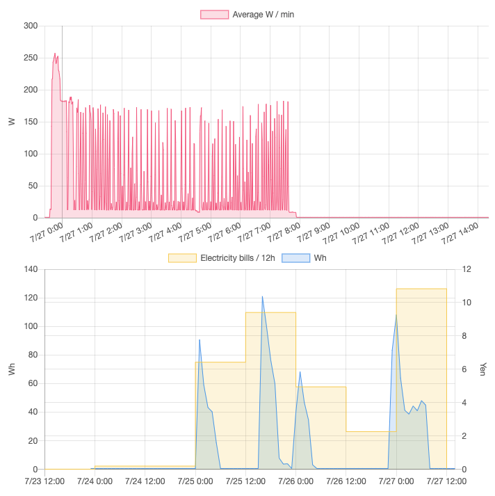

# WATT CHECKER VISUALIZER

[wattchecker-client](https://github.com/j3iiifn/wattchecker-client) のCSVファイルをグラフ化するツール。



## 動作環境
- Raspberry Pi 2 Model B
    - OS: Ubuntu 18.04.2


## インストール方法
依存パッケージをインストールする。

Raspberry Piではpandasをpipでインストールするとビルドに1時間以上掛かりそうだったため、aptでインストールする。

```
$ sudo apt update && sudo apt upgrade -y
$ sudo apt install -y python3-pip python3-venv python3-pandas
```

リポジトリを `/opt/wattchecker-visualizer` にクローンする。

```
$ sudo git clone https://github.com/j3iiifn/wattchecker-visualizer /opt/wattchecker-visualizer
```

`/opt/wattchecker-visualizer` の所有者を変える。

```
sudo chown -R wattchecker:wattchecker /opt/wattchecker-visualizer
```

venvを作成し、`flask` をインストールする。

```
$ cd /opt/wattchecker-visualizer
$ sudo -u wattchecker python3 -m venv --system-site-packages venv
$ . venv/bin/activate
(venv) $ sudo -u wattchecker -H venv/bin/pip install flask
```

依存するJavaScriptモジュールをダウンロードする。

```
sudo -u wattchecker curl -L -o static/moment.min.js https://momentjs.com/downloads/moment.min.js
sudo -u wattchecker curl -L -o static/Chart.bundle.min.js https://github.com/chartjs/Chart.js/releases/download/v2.9.3/Chart.bundle.min.js
```

## 起動方法
必要に応じてファイアウォールの設定を変更する。

コマンド例：

```
$ sudo iptables -nvL --line-numbers
$ sudo iptables -A INPUT -i eth0 -s 192.168.0.0/16 -p tcp --dport 5000 -j ACCEPT
$ sudo iptables -nvL --line-numbers
```

Webサーバを起動する。

```
(venv) $ sudo -u wattchecker -H venv/bin/python app.py {relative/path/to/log/directory} -l {ip_address} -p {port}
```
